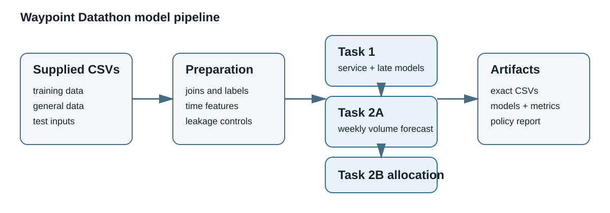
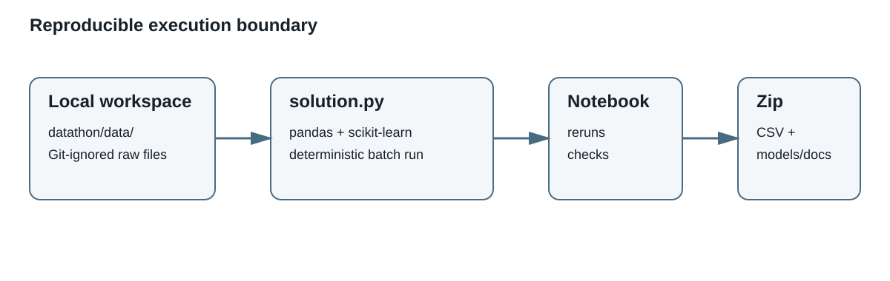

# Datathon solution architecture

This document describes the reproducible, offline evaluation pipeline used for
the three Datathon tasks. It is separate from the Waybill Hackathon runtime.

## Pipeline

## Reproducible execution and deployment boundary

The supplied competition files are read from the local, Git-ignored
`datathon/data/` directory. `solution.py` performs the joins and feature
construction, trains or applies the task models, and writes only the required
submission files plus small model/report artifacts. No external API, hosted
dataset or pre-trained model is used.

| Area | Implementation |
| --- | --- |
| Task 1 labels | Derived by joining deliveries and route legs on route and sequence |
| Task 1 models | Scikit-learn histogram gradient boosting regression and classification pipelines |
| Task 2A forecast | Leakage-safe historical seasonal baseline by depot, brand and ISO week |
| Task 2B planner | Greedy constraint-aware allocator with explicit deferral |
| Validation | Chronological holdout for Task 1 and supplied feasibility checker for Task 2B |
| Reproducibility | `python3 datathon/solution.py` from the repository root |
| Deployment | Submission artifact generation is local and batch-oriented; no production service is required |

## Artifact flow

1. Raw supplied CSVs remain local under `datathon/data/`.
2. Task 1 produces two model files, validation metrics and its exact template-shaped CSV.
3. Task 2A produces the forecast-policy JSON and exact template-shaped CSV.
4. Task 2B produces the allocation-policy JSON and exact template-shaped CSV.
5. The notebook reruns the functions and checks row counts, columns, IDs and valid decisions.
