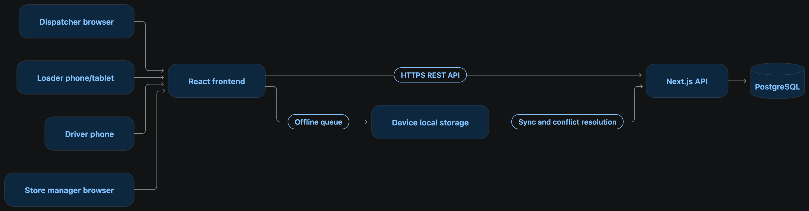

# Waybill architecture

## Purpose

Waybill coordinates one delivery day across four roles: dispatcher, loader,
driver and store manager. The browser experience is responsive and role-scoped;
the driver and loader paths are designed for phone and tablet widths.

## System context

## Components

| Component | Responsibility | Location |
| --- | --- | --- |
| React/Vite frontend | Responsive role experiences, planner, delivery actions, offline UI | `frontend/` |
| Zustand workflow store | Local-first workflow state, device cache, outbox and conflict state | `frontend/src/store/` |
| Domain engine | Order, plan, loading, delivery and sync rules | `frontend/src/domain/` |
| Next.js API | Authentication and persistent role-based workflow endpoints | `backend/app/api/` |
| Prisma | Typed database access and migrations | `backend/prisma/`, `backend/lib/db.ts` |
| PostgreSQL | Durable users, orders, trips, events, receipts and audit records | Docker locally; hosted PostgreSQL in deployment |
| JWT cookie session | Eight-hour HTTP-only session cookie | `backend/lib/auth.ts` |
| Shared state bridge | Persists the current frontend workflow snapshot and synchronizes newer versions | `backend/app/api/state/route.ts` |

## Request and synchronization flow

1. A role signs in through `POST /api/auth/login`.
2. The local workflow store updates the role-specific screen.
3. Online state-changing actions persist through `PUT /api/state`.
4. Each signed-in client polls `GET /api/state` and applies only newer
   versions.
5. When offline, driver actions remain in the device cache/outbox.
6. On reconnect, conflicting changes are shown for a human decision instead of
   silently overwriting either side.

## Operating constraints

The planner validates:

- vehicle weight and volume capacity;
- chilled versus ambient temperature requirements;
- depot ownership;
- brand and district consistency per trip;
- outlet access and mall delivery windows;
- two-trip and route-time budgets;
- remaining fuel quota;
- vehicle workshop and breakdown status;
- deferred orders when available capacity is insufficient.

## Deployment shape

For the hosted demo, the intended shape is two web projects from this
monorepo: `frontend/` as a static Vite site and `backend/` as a Next.js API,
both connected to a managed PostgreSQL database. `VITE_API_BASE_URL` points to
the backend `/api` origin. `FRONTEND_ORIGIN` enables credentialed CORS on the
backend. Local development uses Docker Compose PostgreSQL and the Vite proxy.

## Security boundaries

- `JWT_SECRET` and `DATABASE_URL` are backend-only secrets.
- `VITE_API_BASE_URL` is configuration, not a secret; it is visible in the
  browser bundle.
- Sessions use HTTP-only cookies and production cookies require secure HTTPS.
- The API checks the session role before role-specific mutations.
- `.env` files, credentials and competition datasets are excluded from Git.

## Known implementation boundary

The current integrated frontend remains local-first. Online state-changing UI
actions persist the complete `ServerData` snapshot through `/api/state`, while
the backend also exposes explicit order, plan, trip, sync and receipt routes.
The next production-hardening step would make each screen server-authoritative
through those individual routes instead of using the shared-state compatibility
bridge.
