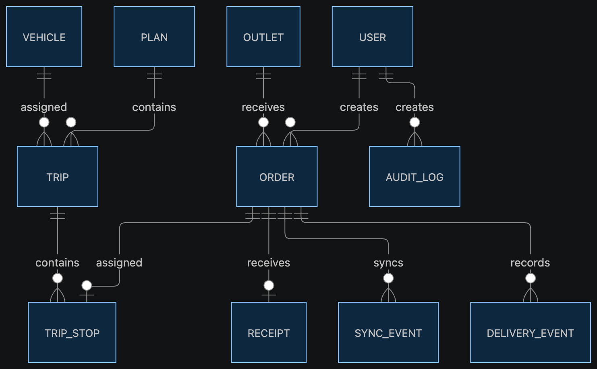

# Waybill data model

The backend uses Prisma with PostgreSQL. The authoritative schema is
[`backend/prisma/schema.prisma`](../backend/prisma/schema.prisma).

## Relational model

## Entity responsibilities

| Entity | Meaning in the delivery day |
| --- | --- |
| `User` | One seeded staff account and role; PINs are stored as hashes. |
| `Outlet` | Store destination, depot, district, access and delivery-window rules. |
| `Vehicle` | Capacity, temperature capability, fuel efficiency, quota and status. |
| `Order` | Store demand, product conditions, quantities and lifecycle status. |
| `Plan` | A dispatcher-created version of a depot’s delivery plan. |
| `Trip` | One vehicle run inside a plan. |
| `TripStop` | Ordered relationship between a trip and an order. |
| `DeliveryEvent` | Driver action, including offline delivery evidence. |
| `Receipt` | Store confirmation, quantity received and discrepancy details. |
| `SyncEvent` | Offline action awaiting application or conflict resolution. |
| `AuditLog` | Trace of important role actions for operational review. |
| `WorldState` | Compatibility snapshot used by the current local-first frontend bridge. |

## Frontend state model

The browser keeps two related structures:

- `ServerData`: the shared delivery-day snapshot containing orders, trips,
  vehicles, notices, events, device presence and planning settings;
- `DeviceData`: device-scoped online status, cached trips, pending outbox
  actions and unresolved conflicts.

`WorldState.state` stores the serialized shared snapshot and increments its
version on every online state write. Clients only apply a remote snapshot when
its version is newer than their local remote version.

## Seeded data

The seed creates:

- four users: dispatcher, loader, driver and store manager;
- two outlets representing chilled and mall-window cases;
- vehicle `VEH001` with reefer capability;
- a realistic confirmed chilled order `ORD-DEMO-001`;
- PIN `1234` for each demo account.
